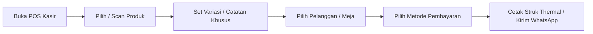

# 🛒 Dokumen Fitur: Sistem Kasir & Transaksi POS Modern

POS UMKM Pro menghadirkan pengalaman transaksi kasir point-of-sale (POS) yang cepat, responsif, dan fleksibel untuk berbagai kebutuhan usaha modern, baik di kasir toko fisik maupun mobile/pesan antar.

---

## ⚡ 1. Keunggulan Utama Modul Kasir

* **Pencarian Kilat & Barcode Scanner**: Cari produk instan melalui nama, kategori, SKU, atau langsung scan barcode via kamera HP / barcode scanner USB & Bluetooth.
* **Multi-Metode Pembayaran**:
  * **Tunai (Cash)**: Hitung otomatis uang diterima & nominal kembalian pecahan cepat.
  * **QRIS Statis & Dinamis**: Tampilkan QRIS resmi toko di layar kasir untuk discan pembeli secara non-tunai.
  * **Transfer Bank & Debit**: Catat referensi pembayaran transfer bank/EDC secara rapi.
  * **Kasbon / Piutang Pelanggan**: Integrasi langsung ke buku kasbon pelanggan terdaftar.
* **Hold & Recall Transaksi (Tahan Transaksi)**: Simpan sementara pesanan pelanggan jika ada barang tertinggal tanpa mengganggu antrian pelanggan di belakangnya.
* **Split Bill & Pembayaran Terpisah**: Dukungan pembagian tagihan per pelanggan atau per item meja untuk bisnis kuliner.
* **Multi-Diskon & Pajak/Service Charge**: Terapkan diskon persentase (%), diskon nominal (Rp), atau voucher promosi serta pajak/service restoran secara otomatis.

---

## 📋 2. Alur Transaksi Kasir Step-by-Step

1. **Memilih Produk**: Klik item pada katalog visual berbasis grid kategori atau gunakan barcode scanner.
2. **Kustomisasi Item**: Tambahkan catatan (misal: *"Less Sugar"*, *"Pedas Sedang"*), level pedas, atau opsi topping.
3. **Pilih Metode Pembayaran**: Masukkan nominal pembayaran tunai atau pilih non-tunai (QRIS/Transfer/Kasbon).
4. **Finalisasi & Cetak**: Sistem otomatis memotong stok barang/bahan baku, mencatat omset ke laporan harian, dan mencetak struk thermal (58mm/80mm) atau share PDF struk ke WhatsApp pembeli.

---

## 👥 3. Manajemen Shift Kasir & Rekap Kas Laci (Cash Drawer)

Mencegah selisih uang kas dan kecurangan staf kasir:
* **Buka Shift Kasir**: Masukkan modal kas awal laci (*cash float*) saat toko mulai buka.
* **Pencatatan Kas Masuk / Kas Keluar Operasional**: Catat pengeluaran kecil kasir (misal: beli es batu, bayar kurir, galon air) langsung di sistem.
* **Tutup Shift & Rekap Kas Otomatis**: Sistem menghitung total penjualan tunai, non-tunai, kas masuk, kas keluar, dan membandingkan dengan uang aktual di laci untuk mendeteksi selisih (*over/short*).
* **Cetak Struk X/Z Report**: Cetak ringkasan shift kasir langsung ke printer thermal.

---

## 📊 4. Spesifikasi Teknis Fitur Kasir

| Spesifikasi | Kemampuan POS UMKM Pro |
| :--- | :--- |
| **Kecepatan Proses Transaksi** | < 1 Detik per transaksi |
| **Dukungan Perangkat** | Smartphone Android, iPhone, Tablet iPad, Laptop, PC Kasir POS |
| **Konektivitas Printer** | Bluetooth Thermal Printer (58mm/80mm), USB Printer, Network LAN |
| **Penyimpanan Data** | Cloud Firestore Real-time + PWA Offline Cache |
| **Keamanan Shift** | PIN Kasir & Log Audit setiap pembatalan transaksi |

---

💡 *Dokumen ini merupakan bagian dari spesifikasi resmi modul POS UMKM Pro (umkm.omnifit.cloud).*
